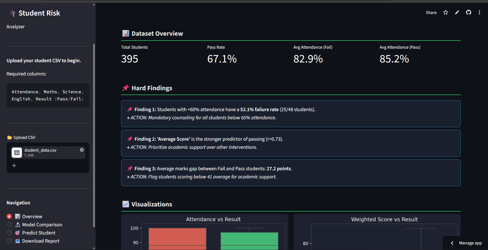
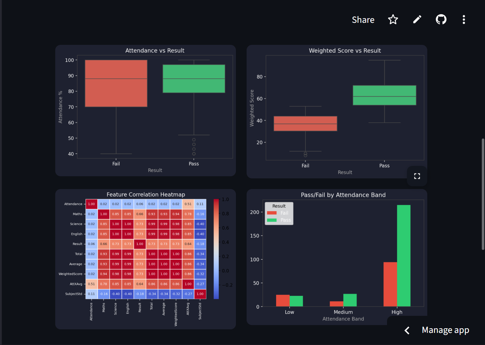
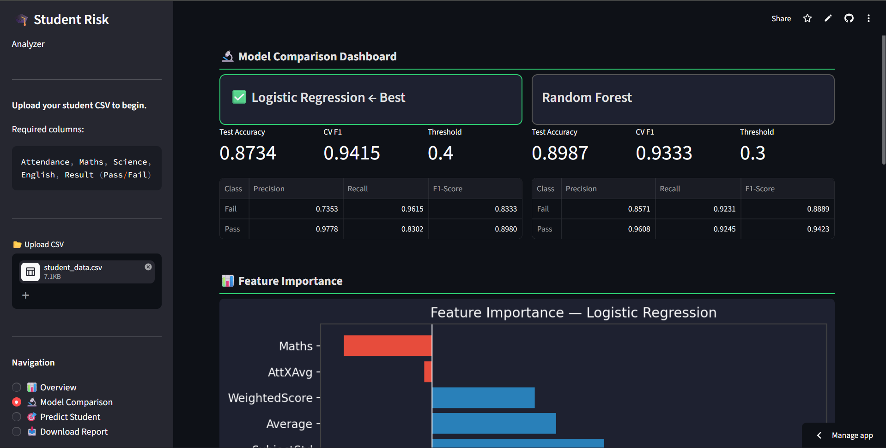
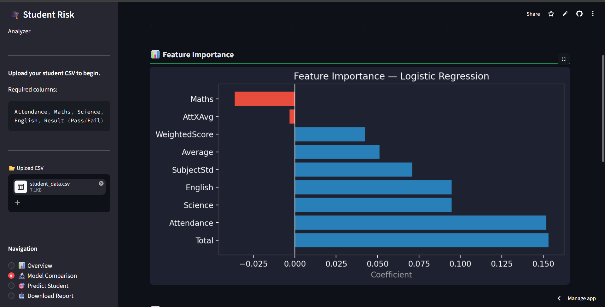
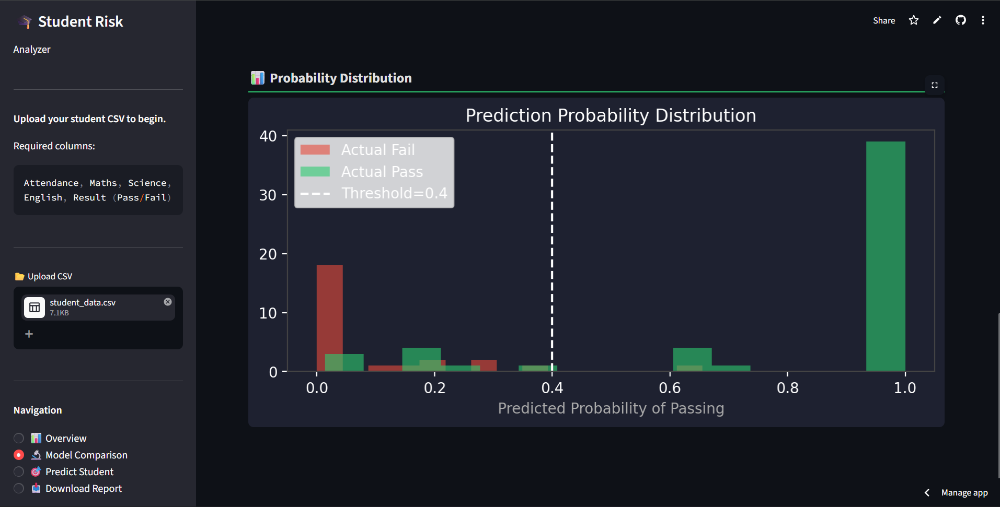
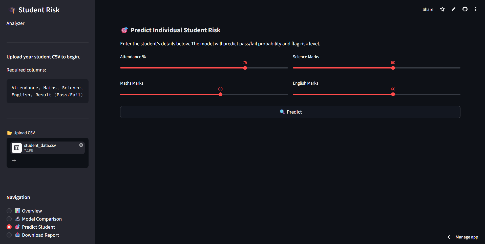

# 🎓 Student Performance Analysis & Risk Detection System

## Overview

An end-to-end data science project that analyzes student academic performance using real-world data from the **UCI Machine Learning Repository** to identify at-risk students and enable early intervention.

This project goes beyond basic prediction — it acts as a **prototype decision support tool** for school administration.

---

## Problem Statement

Schools often identify struggling students too late.  
This project proactively detects at-risk students using data-driven insights, enabling timely academic or attendance-based interventions **before exams** — not after failure.

---

## Dataset

- **Source:** UCI ML Repository — [Student Performance Dataset](https://archive.ics.uci.edu/dataset/320/student+performance)
- **Citation:** Cortez, P. (2008). Student Performance. UCI Machine Learning Repository. https://doi.org/10.24432/C5TG7T
- **Size:** 395 Portuguese secondary school students
- **Features used:** Attendance (derived from absences), Maths (G1), Science (G2), Result (Pass if G3 ≥ 10)
- **Pass rate:** ~67% (realistic, no synthetic generation)

> Raw data mapped via `converter.py` from `student-mat.csv` into pipeline-ready format. G3 (final grade) is used **only** as the target label — not as a feature — to avoid data leakage.

---

## Key Findings

- Students with <60% attendance have a **52.1% failure rate**
- **Average Score** is the stronger predictor of passing (r = 0.73) — not attendance
- Average marks gap between Fail and Pass students: **~27 points**
- High attendance band still produced 94 failures — proves attendance alone is insufficient
- Logistic Regression selected as best model by CV F1 (0.9415) despite Random Forest having higher raw test accuracy (0.8987) — cross-validation is the correct metric for generalization

---

## Technologies

- Python, pandas, NumPy
- scikit-learn (Logistic Regression, Random Forest, StratifiedKFold CV)
- matplotlib, seaborn
- Streamlit (interactive web dashboard)

---

## App Structure

The Streamlit app has 4 sections navigable from the sidebar:

**📊 Overview**  
Dataset summary metrics (total students, pass rate, avg attendance by result), three hard findings with action callouts, four charts (boxplots, correlation heatmap, attendance band breakdown), and a crosstab table.

**🔬 Model Comparison**  
Side-by-side Logistic Regression vs Random Forest — test accuracy, CV F1, optimal threshold, per-class precision/recall/F1. Includes feature importance bar chart, threshold tuning table across 5 thresholds, and probability distribution histogram with decision boundary.

**🎯 Predict Student**  
Sliders for Attendance, Maths, Science, English. Instant prediction with pass/fail confidence bar chart and color-coded risk card — red (high risk), yellow (borderline), green (on track) — with specific driver callouts explaining why the student is at risk.

**📥 Download Report**  
One-click generates a self-contained dark-themed HTML report with dataset summary, key findings, model comparison table, feature importance, and action recommendations. No external dependencies — opens in any browser.

---

## Screenshots

### Overview — Dataset Insights & Hard Findings


### Visualizations — Boxplots, Heatmap, Attendance Band


### Model Comparison Dashboard


### Feature Importance & Threshold Tuning


### Probability Distribution with Decision Threshold


### Predict Student — Risk Scoring


---

## Project Structure

```
student-performance-analysis/
├── data/
│   └── student_data.csv        # Converted UCI dataset
├── screenshots/                # App screenshots for README
├── app.py                      # Streamlit dashboard (4 sections)
├── analysis.py                 # Full CLI pipeline
├── converter.py                # UCI → pipeline format mapper
├── student-mat.csv             # Raw UCI source file
├── requirements.txt
└── README.md
```

---

---

## How to Run

### Option 1: Streamlit App (Recommended)
```bash
pip install -r requirements.txt
streamlit run app.py
```

### Option 2: CLI Pipeline
```bash
python analysis.py
```

### Re-convert Raw UCI Data (Optional)
```bash
python converter.py
```

---

## Live Demo

🔗 [Student Risk Analyzer on Streamlit Cloud](https://student-risk-analyzer.streamlit.app/)

---

## Model Performance

| Model | Test Accuracy | CV F1 (5-fold) | Optimal Threshold |
|---|---|---|---|
| Logistic Regression ✅ | 0.8734 | 0.9415 ± 0.019 | 0.4 |
| Random Forest | 0.8987 | 0.9333 ± 0.017 | 0.3 |

> Logistic Regression selected as best model — higher CV F1 indicates better generalization. Threshold tuned to maximize recall on Fail class, minimizing missed at-risk students.

---

## Future Improvements

- Add SHAP explainability for individual prediction reasoning
- Real-time student monitoring with database integration
- Multi-school dataset support
- REST API backend for institutional integration

---

## Author

**Chirag Sharma**  
BTech IT | Aspiring Data Analyst / Data Scientist  
[GitHub](https://github.com/ChiragSharma2026)